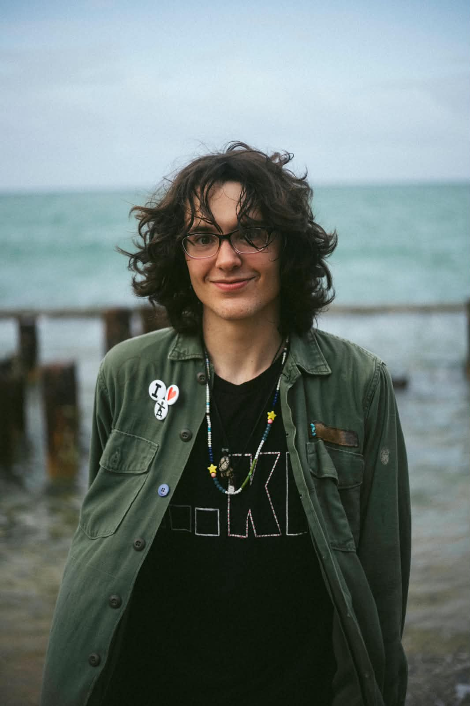

## **Sobre Mi**:
#### Mi nombre es __Edu Lastra Cancela__ (pronombres: __ella__) y soy estudiante graduada de maestría en Biologia de la __Universidad de Puerto Rico en el Recinto de Mayagüez__. Mis intereses en la investigación actualmente es aportar a la __conservación de herpetofauna__ en Puerto Rico (PR) especificamente en el grupo de los lagartijos. __Mi meta en un futuro__ es ser profesora de algún recinto de las UPR y ser investigadora en anfibios y reptiles nativos y endémicos a Puerto Rico. __Mis pasiones__, fuera de mis metas academicas, incluyen la musica, la patineta y el arte (de/en diferentes medios).
```{r echo=FALSE}

```
## R Tutorials:
### [R_tutorial_1](R_tutorial_1.html)

